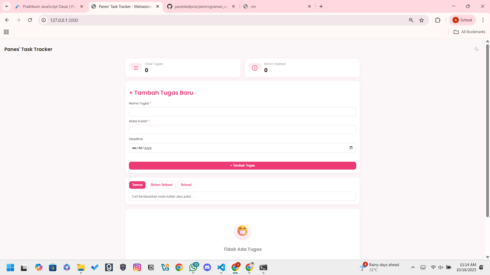
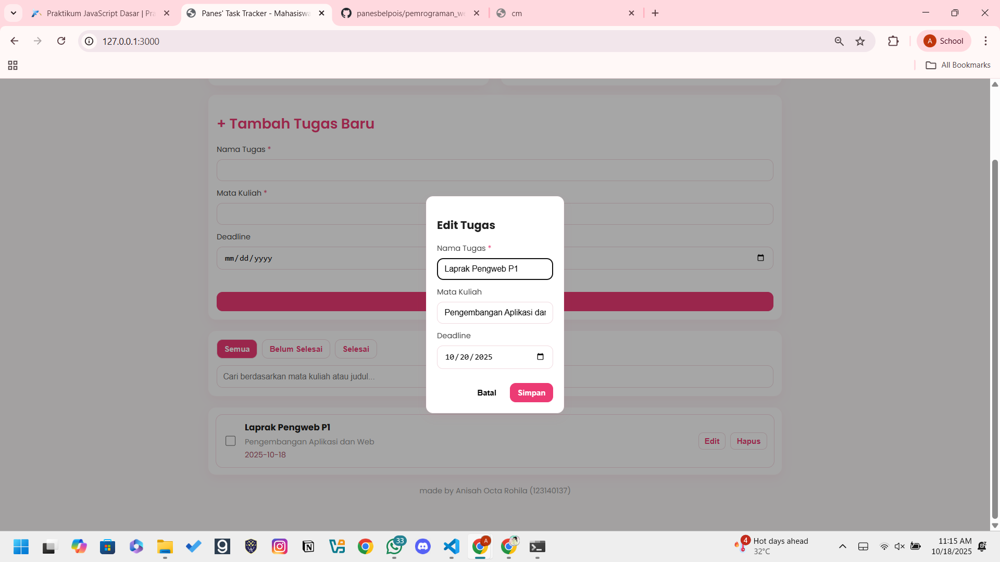
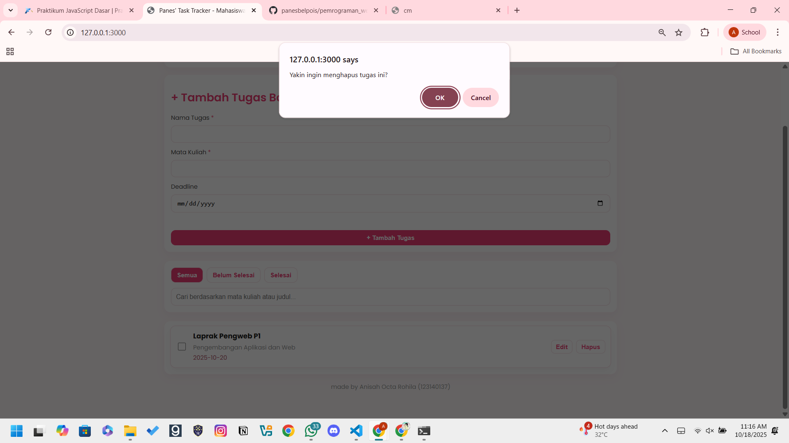
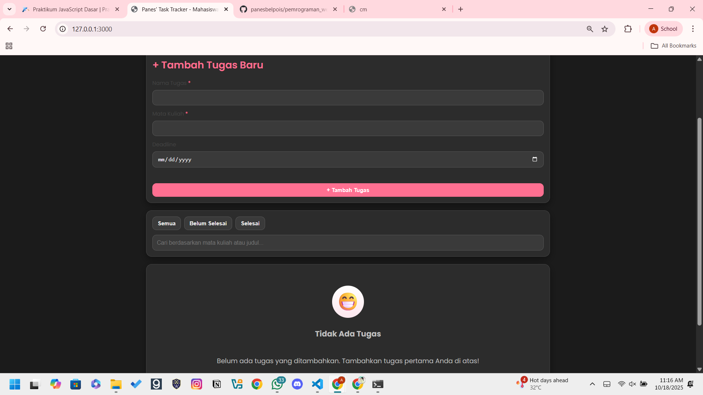

# Panes' Task Tracker


**Panes' Task Tracker** adalah aplikasi web *task management* sederhana yang dirancang khusus untuk mahasiswa. Aplikasi ini membantu pengguna untuk mencatat, mengelola, dan melacak semua tugas kuliah mereka dengan antarmuka yang bersih, intuitif, dan responsif. Semua data disimpan secara lokal di browser menggunakan `localStorage`, sehingga tugas tidak akan hilang saat halaman di-refresh.

---

## 📸 Tangkapan Layar (Screenshots)

Berikut adalah beberapa tampilan dari aplikasi, termasuk fitur utama dan mode gelap.

| Tampilan Utama (Light) | Tugas Ditambahkan & Statistik | Mode Edit Tugas |
| :---: | :---: | :---: |
|  |  |  |

| Tampilan Dark Mode | Fitur Pencarian & Filter |
| :---: | :---: |
|  |  |


---

## ✨ Fitur-Fitur

Aplikasi ini dilengkapi dengan serangkaian fitur untuk meningkatkan produktivitas:
- ✅ **Manajemen Tugas (CRUD)**: Menambah, melihat, mengedit, dan menghapus tugas dengan mudah.
- ✅ **Penyimpanan Lokal**: Data tugas tersimpan aman di `localStorage` browser, sehingga tidak hilang saat tab ditutup.
- ✅ **Mode Gelap & Terang**: Tampilan tema yang dapat diubah sesuai preferensi pengguna dan disimpan pengaturannya.
- ✅ **Filter Tugas**: Saring tugas berdasarkan status: "Semua", "Belum Selesai", atau "Selesai".
- ✅ **Pencarian Cepat**: Cari tugas secara instan berdasarkan nama tugas atau mata kuliah.
- ✅ **Statistik Tugas**: Lihat ringkasan jumlah total tugas dan tugas yang belum selesai.
- ✅ **Validasi Form**: Mencegah penambahan tugas kosong untuk menjaga integritas data.
- ✅ **Desain Responsif**: Tampilan yang optimal di berbagai ukuran layar, baik desktop maupun mobile.

---

## 🚀 Cara Menjalankan Aplikasi

Proyek ini adalah aplikasi web statis dan tidak memerlukan proses instalasi yang rumit. Cukup ikuti langkah-langkah berikut:

1.  **Clone Repositori**
    ```bash
    git clone [https://github.com/](https://github.com/)[NAMA_USER_ANDA]/[NAMA_REPO_ANDA].git
    ```

2.  **Masuk ke Direktori Proyek**
    ```bash
    cd [NAMA_REPO_ANDA]
    ```

3.  **Buka di Browser**
    Cukup buka file `index.html` langsung di browser favorit Anda (misalnya Google Chrome, Firefox, atau Edge).

---

## 🛠️ Penjelasan Teknis

Berikut adalah penjelasan mengenai beberapa implementasi teknis utama dalam proyek ini.

### 1. Penggunaan `localStorage`
Aplikasi ini memanfaatkan **Web Storage API**, khususnya `localStorage`, untuk menyimpan data tugas secara persisten di browser pengguna.

-   **Penyimpanan Data**: Setiap kali pengguna menambah, mengedit, atau menghapus tugas, seluruh *array* `tasks` akan diubah menjadi format string JSON menggunakan `JSON.stringify()` dan disimpan ke `localStorage` dengan *key* `"panes_tasks_v1"`.
-   **Pengambilan Data**: Saat aplikasi pertama kali dimuat, fungsi `loadTasks()` akan memeriksa `localStorage`. Jika *key* tersebut ada, data string akan diambil dan diubah kembali menjadi objek JavaScript menggunakan `JSON.parse()` untuk ditampilkan di antarmuka.
-   **Keuntungan**: Metode ini memastikan data pengguna tetap ada bahkan setelah browser ditutup, memberikan pengalaman pengguna yang mulus tanpa memerlukan database backend.

### 2. Validasi Form
Untuk memastikan data yang dimasukkan berkualitas, aplikasi ini menerapkan validasi form sederhana di sisi klien (*client-side*).

-   **Pemeriksaan Input Kosong**: Sebelum sebuah tugas baru ditambahkan atau data tugas yang ada disimpan, skrip akan memeriksa apakah input "Nama Tugas" (`#titleInput` dan `#editTitle`) kosong setelah menghapus spasi di awal dan akhir (`.trim()`).
-   **Umpan Balik Pengguna**: Jika validasi gagal (input kosong), proses penyimpanan akan dihentikan, dan sebuah pesan error akan ditampilkan di bawah form (`#formError` atau `#editError`) untuk memberitahu pengguna bahwa kolom tersebut wajib diisi.

---

## 💻 Teknologi yang Digunakan

-   **HTML5**: Untuk struktur dan konten halaman web.
-   **CSS3**: Untuk styling, layout, dan desain responsif, termasuk penggunaan CSS Variables untuk tema.
-   **Vanilla JavaScript (ES6+)**: Untuk semua logika aplikasi, interaksi DOM, dan manajemen data.

---
Dibuat oleh **Anisah Octa Rohila (123140137)**
