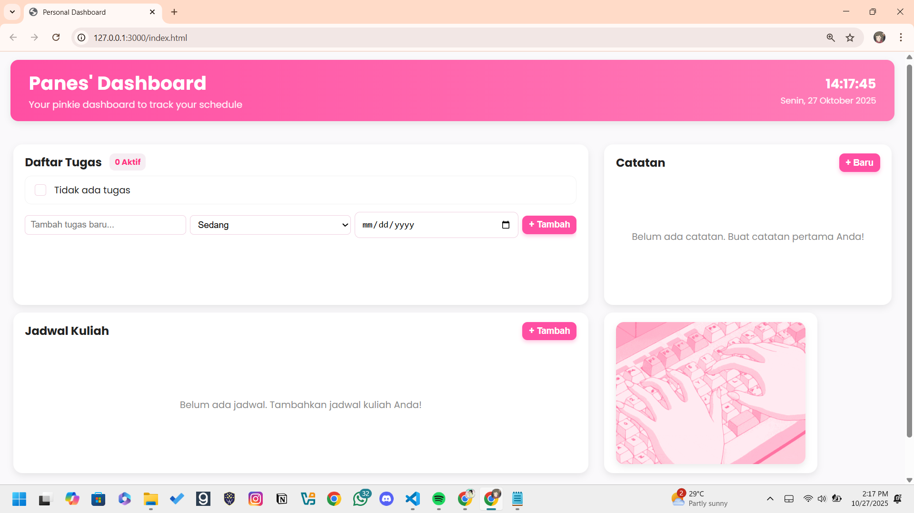
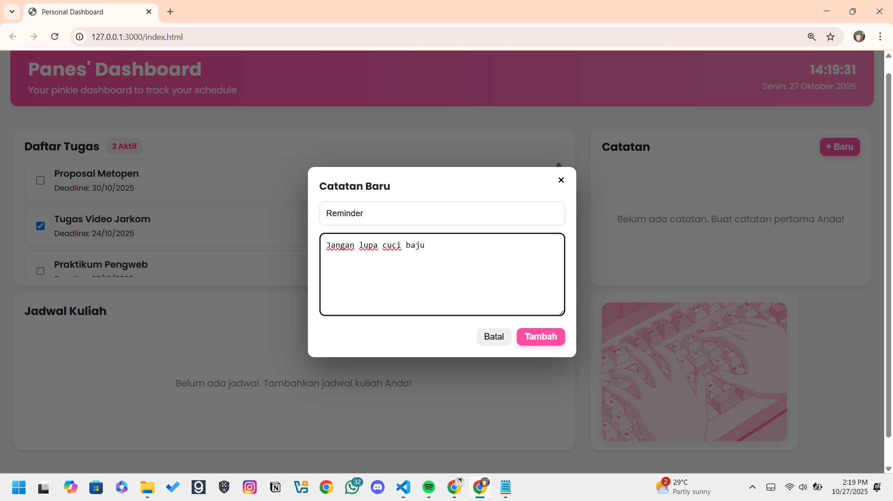
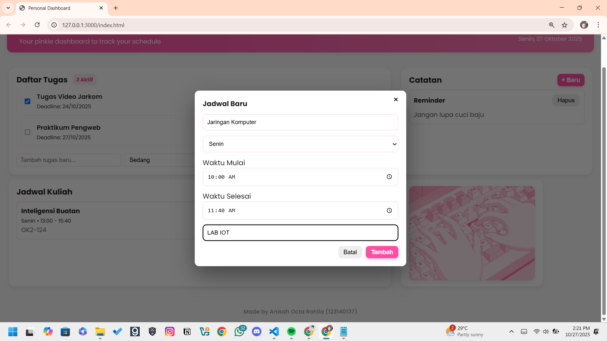
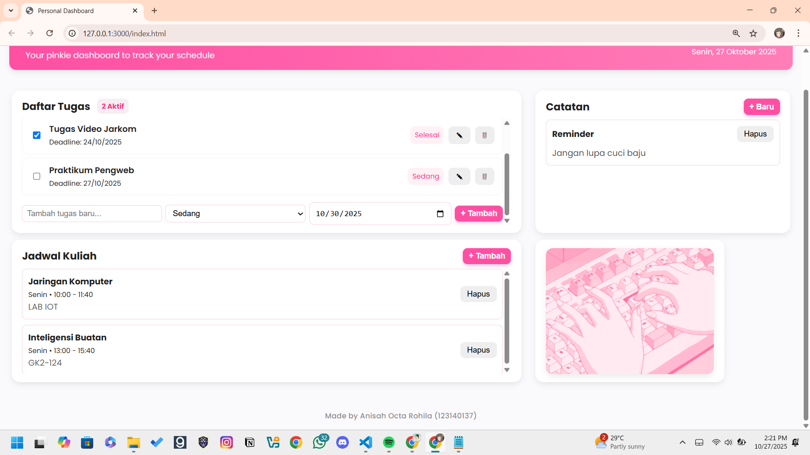

# Panes' Dashboard 📝

Dashboard ini adalah aplikasi web sederhana yang membantu pengguna mengelola kegiatan sehari-hari melalui tiga fitur utama: Daftar Tugas, Catatan Pribadi, dan Jadwal Kegiatan. Aplikasi ini dibuat menggunakan HTML, CSS, dan JavaScript (ES6+) serta memanfaatkan localStorage agar data tetap tersimpan meskipun halaman direfresh.

---

## 📸 Screenshot Tampilan

Berikut adalah beberapa tampilan dari aplikasi:

### Tampilan Utama 

*Tampilan utama aplikasi sebelum ditambahkan untuk tracking*
### Menambahkan Tugas

*Fitur untuk menambahkan tugas*
### Menambahkan Catatan

*Memambahkan catatan*
### Menambahkan Jadwal Kuliah

*Penambahan jadwal kuliah pada dashboard*
### Tampilan keseluruhan

*Tampilan aplikasi jika semua fitur sudah ditambahkan sesuai kebutuhan pengguna*
---

## ✨ Fitur-Fitur

Aplikasi ini dilengkapi dengan berbagai fitur untuk meningkatkan produktivitas:

- ✅ **Manajemen Tugas (CRUD):** Tambah, lihat, edit, dan hapus tugas dengan mudah melalui antarmuka yang ramah pengguna.
- ✅ **Penyimpanan Lokal:** Tugas tersimpan secara otomatis di `localStorage` browser, sehingga data tidak akan hilang saat halaman di-refresh atau ditutup.
- ✅ **Status Tugas:** Tandai tugas sebagai "selesai" atau "belum selesai" hanya dengan satu klik pada checkbox.
- ✅ **Filter & Pencarian:** Saring tugas berdasarkan status (Semua, Belum Selesai, Selesai) dan cari tugas spesifik berdasarkan judul atau nama mata kuliah.
- ✅ **Statistik Tugas:** Pantau progres dengan melihat ringkasan jumlah total tugas dan jumlah tugas yang belum selesai.
- ✅ **Tema Ganda (Light/Dark Mode):** Ganti tema antara terang dan gelap sesuai preferensi Anda. Pilihan tema juga akan disimpan.
- ✅ **Desain Responsif:** Tampilan yang optimal dan menyesuaikan dengan berbagai ukuran layar, baik di desktop maupun perangkat mobile.

- ✅ **Manajemen Tugas (CRUD):** Tambah, lihat, dan hapus tugas dengan mudah melalui antarmuka yang intuitif.
- ✅ **Catatan Pribadi:** Simpan catatan singkat, ide penting, atau pengingat dengan tampilan modal yang menarik dan mudah digunakan.
- ✅ **Jadwal Kegiatan:** Tambahkan jadwal atau agenda penting agar tidak melewatkan kegiatan harian.
- ✅ **Penyimpanan Lokal:** Semua data (tugas, catatan, dan jadwal) tersimpan otomatis di localStorage browser sehingga tetap aman meski halaman di-refresh atau browser ditutup.
- ✅ **Status Tugas:** Tandai tugas sebagai selesai atau belum selesai hanya dengan satu klik untuk memantau progres dengan cepat.
- ✅ **Antarmuka Interaktif:** Menggunakan jQuery dan animasi CSS untuk pengalaman pengguna yang responsif dan menyenangkan.
- ✅ **Desain Responsif:** Tampilan menyesuaikan berbagai ukuran layar, baik di perangkat desktop maupun mobile.
---

## 🚀 Cara Menjalankan Aplikasi

Aplikasi ini dibuat dengan HTML, CSS, dan JavaScript murni, sehingga tidak memerlukan proses instalasi yang rumit.

1.  **Clone Repositori**
    ```bash
    git clone [https://github.com/panesbelpois/pemrograman_web_itera_123140137.git](https://github.com/panesbelpois/pemrograman_web_itera_123140137.git)
    ```

2.  **Masuk ke Direktori Proyek**

3.  **Buka File `index.html`**
    Cukup buka file `index.html` di vscode.

---

# Daftar Fitur ES6+ yang Diimplementasikan

Aplikasi Personal Dashboard ini dikembangkan menggunakan sintaks modern JavaScript (ES6+) untuk menghasilkan kode yang lebih efisien, modular, dan mudah dibaca. Berikut adalah daftar fitur ES6+ yang digunakan beserta penjelasannya:

| Fitur ES6+ | Penjelasan | Implementasi dalam Aplikasi |
| :--- | :--- | :--- |
| **`let` dan `const`** | Digunakan untuk deklarasi variabel dengan *scope* blok agar lebih aman dan mudah dikelola. | Semua variabel data (`tasks`, `notes`, `schedules`) dan elemen DOM menggunakan `const` untuk nilai tetap, `let` untuk nilai yang berubah. |
| **Arrow Function (`() => {}`)** | Menulis fungsi singkat dan menjaga konteks `this` tetap konsisten. | Digunakan pada event listener dan fungsi manipulasi data, seperti `tasks.forEach(task => { ... })`. |
| **Template Literal (``...${ }``)** | Membuat *string* dinamis dan menyisipkan variabel langsung di dalam HTML. | Dipakai untuk menampilkan daftar tugas, catatan, dan jadwal dengan HTML yang di-*render* secara dinamis. |
| **Destructuring Assignment** | Mengambil nilai dari objek atau array secara ringkas tanpa harus memanggil properti satu per satu. | Digunakan untuk memproses data objek saat memuat ulang dari `localStorage`. |
| **Array Methods (`map`, `filter`, `forEach`)** | Memproses dan memanipulasi data array dengan cara yang lebih bersih dan efisien. | Menampilkan daftar tugas, menghapus item tertentu, dan memperbarui data catatan atau jadwal. |
| **Spread Operator (`...`)** | Menyalin atau menggabungkan array dan objek tanpa mengubah data asli. | Dipakai untuk menambahkan item baru ke dalam daftar data. |
| **LocalStorage API** | Menyimpan data pengguna secara permanen di browser tanpa database eksternal. | Semua data (tugas, catatan, dan jadwal) tersimpan otomatis di `localStorage` agar tetap tersedia setelah halaman ditutup. |
| **Event Listener Modern (`addEventListener`)** | Menangani interaksi pengguna secara modular tanpa *inline event*. | Digunakan untuk menangani aksi seperti klik tombol tambah, hapus, dan simpan catatan. |
---

## 💻 Teknologi yang Digunakan

-   **HTML5**
-   **CSS3**
-   **JavaScript (ES6+)**
