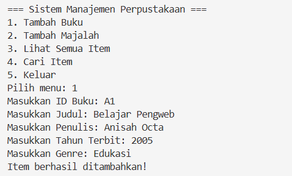
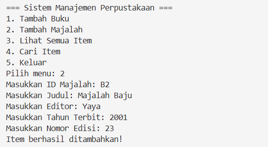
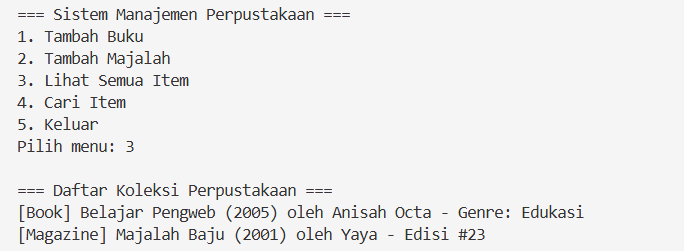
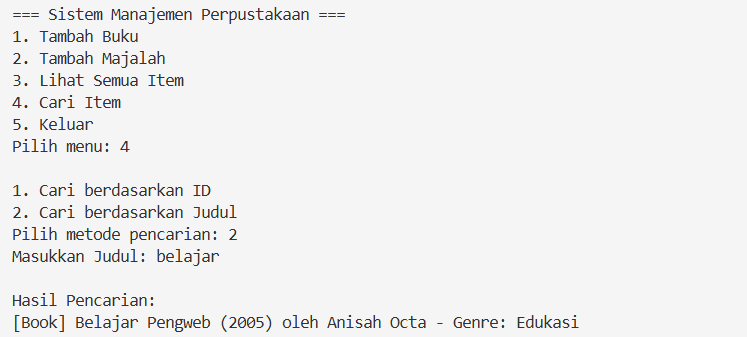
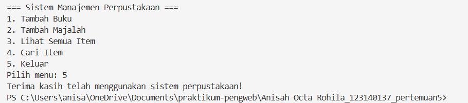
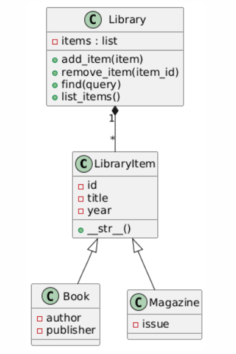

Deskripsi Singkat
-----------------
Program ini adalah aplikasi sederhana untuk mengelola koleksi perpustakaan (books dan magazines) yang terdiri dari modul-modul berikut:

- `library_item.py` : Kelas dasar untuk item perpustakaan.
- `book.py` : Implementasi item tipe buku.
- `magazine.py` : Implementasi item tipe majalah.
- `library.py` : Manajemen koleksi (tambah, hapus, cari, tampilkan).
- `main.py` : Runner/antarmuka sederhana untuk menjalankan program.

Fungsi Utama & Fitur
--------------------
- Menambahkan dan menghapus item (buku/majalah).
- Menampilkan daftar item yang tersimpan.
- Pencarian item berdasarkan atribut dasar (mis. judul, pengarang).
- Struktur modul yang terpisah untuk memudahkan perluasan.

Cara Menjalankan
----------------
1. Pastikan Python sudah terinstal (Python 3.7+ direkomendasikan).
2. Buka terminal di folder proyek (mis. `c:\Users\anisa\OneDrive\Documents\praktikum-pengweb\Anisah Octa Rohila_123140137_pertemuan5`).
3. Jalankan:

```powershell
python main.py
```

Screenshot Hasil Running Program
-------------------------------
### Tambah buku

### Tambah majalah

### Lihat semua item

### Cari item

### Keluar



Diagram Kelas 
-------------------------------------


