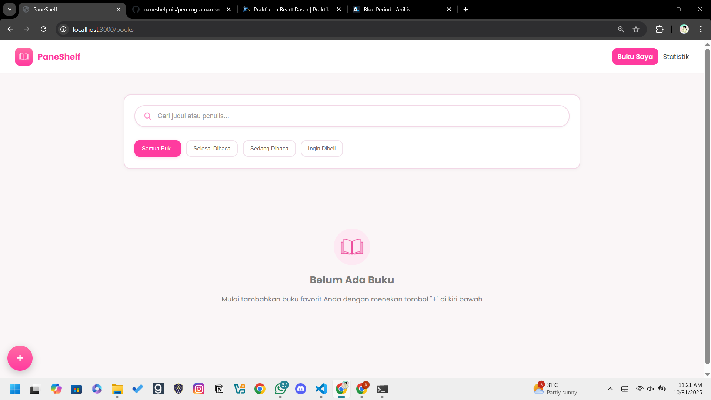
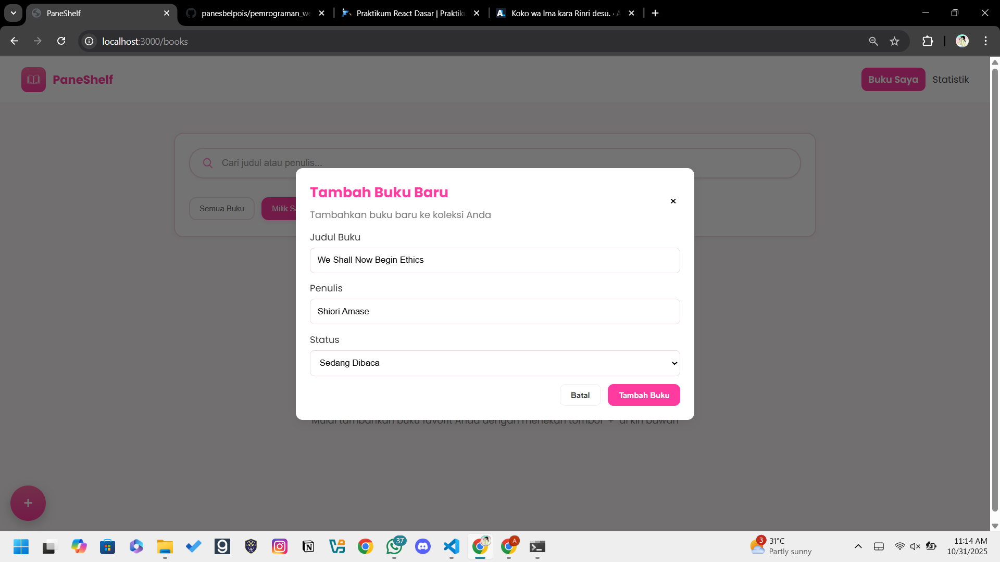
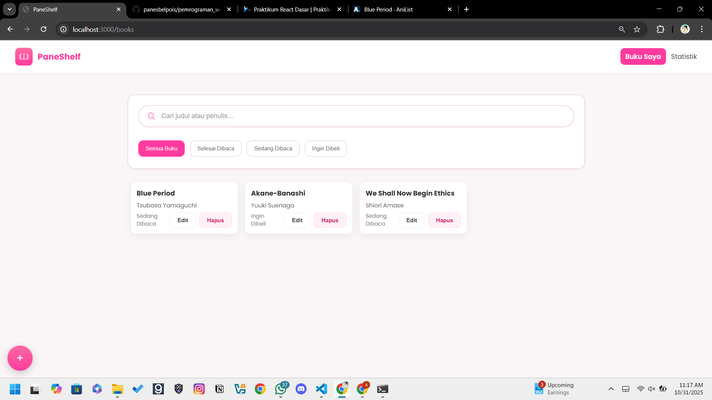
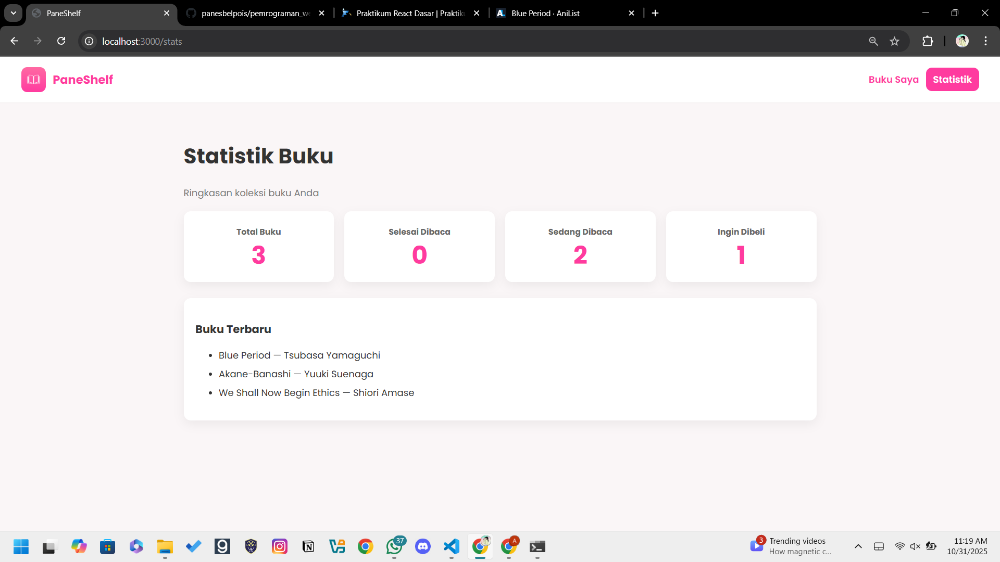

# PaneShelf

[](https://opensource.org/licenses/MIT)
[](https://reactjs.org/)
[](https://reactrouter.com/)
[](https://jestjs.io/)

PaneShelf adalah aplikasi web berbasis React yang berfungsi sebagai pelacak koleksi buku pribadi. Pengguna dapat dengan mudah menambah, melihat, mengedit, menghapus, dan memfilter buku-buku dalam perpustakaan digital mereka.

---

## 1. Deskripsi Aplikasi

Aplikasi ini menyediakan antarmuka yang bersih dan sederhana untuk manajemen buku. Dibangun menggunakan **Create React App** dengan **React Router** untuk navigasi dan **React Context API** untuk manajemen state global.

### Fitur Utama
* **Manajemen Buku (CRUD):** Pengguna dapat **Menambah** buku baru, **Melihat** (Read) daftar buku, **Memperbarui** (Update) detail buku, dan **Menghapus** (Delete) buku dari koleksi.
* **Filter Buku:** Buku dapat difilter berdasarkan statusnya: "Semua Buku", "Sedang Dibaca", dan "Ingin Dibeli".
* **Navigasi Halaman:** Aplikasi ini memiliki dua halaman utama: "Buku Saya" (halaman utama) dan "Statistik", yang dapat diakses melalui `Navbar`.
* **State Management:** Menggunakan React Context API (`BookProvider`) untuk mengelola daftar buku secara global, sehingga semua komponen memiliki akses ke data yang konsisten.
* **Antarmuka Responsif (Dasar):** Didesain dengan komponen modern seperti modal (untuk form) dan *floating action button* (untuk menambah buku).

---

## 2. Screenshot Antarmuka

### Tampilan Utama (Saat Belum Ada Buku)
Tampilan awal aplikasi ketika koleksi buku masih kosong.



### SS2: Tampilan Menambahkan Buku
Formulir modal yang muncul saat pengguna menekan tombol `+` untuk menambahkan buku baru.



### SS3: Tampilan Saat Buku Sudah Ditambahkan
Tampilan utama setelah beberapa buku ditambahkan ke dalam koleksi, ditampilkan dalam format kartu.



### SS4: Tampilan Statistik Buku
Halaman statistik yang menunjukkan rekapitulasi koleksi buku (catatan: fungsionalitas ini mungkin masih dalam pengembangan).



---

## 3. Instruksi Instalasi dan Menjalankan

### Prasyarat
Pastikan Anda telah menginstal:
* [Node.js](https://nodejs.org/) (v14 atau lebih baru)
* [npm](https://www.npmjs.com/) (biasanya terinstal bersama Node.js)

### Langkah-langkah
1.  **Kloning Repositori**
    ```bash
    git clone [URL_REPOSITORI_ANDA]
    cd my-bukuku-app
    ```

2.  **Instal Dependensi**
    Jalankan perintah berikut di terminal untuk menginstal semua paket yang diperlukan dari `package.json`.
    ```bash
    npm install
    ```

3.  **Menjalankan Aplikasi (Mode Pengembangan)**
    Perintah ini akan menjalankan aplikasi dalam mode pengembangan dan membukanya di [http://localhost:3000](http://localhost:3000).
    ```bash
    npm start
    ```

4.  **Menjalankan Pengujian (Testing)**
    Aplikasi ini menggunakan Jest dan React Testing Library. Untuk menjalankan semua unit test:
    ```bash
    npm test
    ```

5.  **Membuat Build (Mode Produksi)**
    Perintah ini akan membuat *build* aplikasi yang telah dioptimalkan untuk produksi di dalam folder `build/`.
    ```bash
    npm run build
    ```

---

## 4. Penjelasan Fitur React yang Digunakan

Aplikasi ini dibangun dengan memanfaatkan fitur-fitur inti dan modern dari React:

* **React Hooks**:
    * **`useState`**: Digunakan secara ekstensif untuk mengelola state lokal, seperti mengontrol status *modal* (terbuka/tertutup) di halaman `Home`, mengelola *filter* yang aktif di `BookFilter.jsx`, dan mengelola nilai *input* di `BookForm.jsx`.
    * **`useEffect`**: Digunakan dalam `BookForm.jsx` untuk menyinkronkan state formulir. *Hook* ini "mendengarkan" perubahan pada *prop* `initial`. Jika `initial` (data buku untuk diedit) tersedia, `useEffect` akan mengisi *state* formulir dengan data tersebut.
    * **`useContext`**: Digunakan secara implisit melalui `BookProvider` (didefinisikan di `index.js`). Ini adalah implementasi dari React Context API yang menyediakan *state* global (daftar buku, fungsi tambah/edit/hapus) ke seluruh pohon komponen tanpa perlu *prop-drilling*.

* **React Router (`react-router-dom`)**:
    * **`<BrowserRouter>`**: Membungkus seluruh aplikasi di `index.js` untuk mengaktifkan *client-side routing*.
    * **`<Routes>`, `<Route>`, `<Navigate>`**: Digunakan di `App.js` untuk mendefinisikan rute URL. Rute `/` secara otomatis dialihkan (`<Navigate>`) ke `/books`, sementara `/books` me-render halaman `Home` dan `/stats` me-render halaman `Stats`.
    * **`useLocation`**: *Hook* ini digunakan di `Navbar.jsx` untuk mendeteksi URL saat ini (`location.pathname`). Informasi ini digunakan untuk memberikan *style* khusus (highlight) pada tautan navigasi yang sedang aktif.
    * **`<Link>`**: Digunakan di `Navbar.jsx` untuk navigasi antar halaman tanpa me-refresh browser.

* **Pemisahan Komponen**:
    Proyek ini memecah antarmuka menjadi komponen-komponen yang dapat digunakan kembali (`reusable components`) seperti `Navbar.jsx`, `BookList.jsx`, `BookFilter.jsx`, `BookForm.jsx`, dan `FloatingButton.jsx`.

---

## 5. Sorotan Kode Penting

Berikut adalah penjelasan dan cuplikan kode dari file-file komponen utama dalam proyek ini, yang menunjukkan bagaimana fitur-fitur React digunakan.

---

### `index.js` (Entry Point & Context Provider)

File ini adalah titik masuk (entry point) utama aplikasi. File ini menggunakan `createRoot` dari React 18 dan membungkus seluruh aplikasi dengan:

1. **`<BrowserRouter>`**: Mengaktifkan *client-side routing* untuk seluruh aplikasi.
2. **`<BookProvider>`**: Menyediakan *state* manajemen buku (seperti daftar buku, fungsi tambah/hapus) ke semua komponen di dalamnya menggunakan React Context API.

```javascript
// file: src/index.js

import React from 'react';
import { createRoot } from 'react-dom/client';
import { BrowserRouter } from 'react-router-dom';
import App from './App';
// Mengimpor BookProvider dari Context
import { BookProvider } from './context/BookContext';
import './index.css';

// Metode createRoot baru untuk React 18
const root = createRoot(document.getElementById('root'));
root.render(
  <React.StrictMode>
    {/* BrowserRouter mengaktifkan routing di seluruh aplikasi */}
    <BrowserRouter>
      {/* BookProvider menyediakan state global untuk komponen di dalamnya */}
      <BookProvider>
        <App />
      </BookProvider>
    </BrowserRouter>
  </React.StrictMode>
);
```

---

### `App.js` (Definisi Routing Halaman)

Komponen App adalah komponen inti yang mengatur layout utama dan mendefinisikan rute-rute URL aplikasi menggunakan React Router v6. Komponen ini menampilkan Navbar secara permanen dan menukar konten halaman (Home atau Stats) berdasarkan URL.

```javascript
// file: src/App.js

import React from 'react';
// Mengimpor komponen routing v6
import { Routes, Route, Navigate } from 'react-router-dom';
import Navbar from './components/Navbar';
import Home from './pages/Home';
import Stats from './pages/Stats';

function App(){
  return (
    <div className="app">
      {/* Navbar selalu tampil di setiap halaman */}
      <Navbar />
      <main className="main-content">
        {/* <Routes> adalah container untuk semua definisi <Route> */}
        <Routes>
          {/* Rute default ("/") akan otomatis mengarahkan ke "/books" */}
          <Route path="/" element={<Navigate to="/books" replace />} />
          
          {/* Rute utama untuk daftar buku */}
          <Route path="/books" element={<Home />} />
          
          {/* Rute untuk halaman statistik */}
          <Route path="/stats" element={<Stats />} />
        </Routes>
      </main>
    </div>
  );
}

export default App;
```

---

### `Navbar.jsx` (Navigasi Dinamis)

Komponen Navbar menampilkan tautan navigasi. Ini adalah contoh bagus penggunaan hook `useLocation` dari React Router untuk mendeteksi halaman mana yang sedang aktif dan menerapkan style (gaya) secara dinamis pada tautan yang sesuai.

```javascript
// file: src/components/Navbar.jsx

import React from 'react';
// Mengimpor <Link> untuk navigasi dan useLocation untuk deteksi rute
import { Link, useLocation } from 'react-router-dom';
import bookIcon from '../assets/book1.png';

export default function Navbar(){
  // Mendapatkan objek lokasi saat ini dari React Router
  const location = useLocation();

  // Memeriksa apakah pathname saat ini cocok dengan rute
  // Ini digunakan untuk menyorot tautan yang aktif
  const isBooks = location.pathname === '/' || location.pathname.startsWith('/books');
  const isStats = location.pathname.startsWith('/stats');

  // ... (definisi style) ...

  return (
    <header className="app-header">
      {/* ... (kode branding) ... */}
      <nav style={{display:'flex',gap:12,alignItems:'center'}}>
        {/* Menggunakan <Link> untuk navigasi tanpa me-refresh halaman */}
        <Link
          to="/books"
          // Menerapkan style/class secara kondisional berdasarkan rute aktif
          className={isBooks ? 'btn btn-pink' : undefined}
          style={isBooks ? { ...boxedStyle, ... } : plainTextStyle}
        >
          Buku Saya
        </Link>

        <Link
          to="/stats"
          className={isStats ? 'btn btn-pink' : undefined}
          style={isStats ? { ...boxedStyle, ... } : { ... }}
        >
          Statistik
        </Link>
      </nav>
    </header>
  );
}
```

---

### `BookList.jsx` (List Rendering & Conditional Rendering)

Komponen ini bertanggung jawab untuk me-render daftar buku. Ini menunjukkan dua konsep penting:

- **Conditional Rendering**: Jika array books kosong, ia akan menampilkan pesan "Belum Ada Buku".
- **List Rendering**: Jika ada buku, ia akan me-mapping array tersebut menjadi daftar elemen JSX (`<div className="book-card">`).

```javascript
// file: src/components/BookList.jsx

import React from 'react';
import bookIcon from '../assets/book2.png';

// Menerima props: daftar 'books', dan fungsi 'onEdit' & 'onDelete'
export default function BookList({ books = [], onEdit, onDelete }){
  
  // 1. Conditional Rendering: Tampilan jika tidak ada buku
  if(!books.length){
    return (
      <div className="empty-state">
        {/* ... (kode untuk tampilan empty state) ... */}
        <h2>Belum Ada Buku</h2>
        <p>Mulai tambahkan buku favorit Anda...</p>
      </div>
    )
  }

  // 2. List Rendering: Tampilan jika ada buku
  return (
    <div className="book-list">
      {/* Mapping array 'books' menjadi elemen JSX */}
      {books.map(book => (
        <div key={book.id} className="book-card">
          <div>
            <h4>{book.title}</h4>
            <p>{book.author || '—'}</p>
          </div>
          <div style={{...}}>
            <div>{book.status}</div>
            <div>
              {/* Meneruskan fungsi 'onEdit' dan 'onDelete' ke tombol */}
              <button className="btn btn-outline" onClick={() => onEdit(book)}>Edit</button>
              <button className="btn" ... onClick={() => onDelete(book.id)}>Hapus</button>
            </div>
          </div>
        </div>
      ))}
    </div>
  );
}
```

---

### `BookForm.jsx` (Manajemen State Form dengan Hooks)

Komponen formulir modal ini adalah contoh bagus dari penggunaan hook React. `useState` digunakan untuk mengelola setiap input form, dan `useEffect` digunakan untuk mengisi data formulir secara otomatis saat komponen dibuka dalam mode "Edit" (dengan prop `initial`).

```javascript
// file: src/components/BookForm.jsx

import React, { useState, useEffect } from 'react';

export default function BookForm({ open, onClose, onSubmit, initial }){
  // Menggunakan useState untuk mengelola setiap input form
  const [title, setTitle] = useState('');
  const [author, setAuthor] = useState('');
  const [status, setStatus] = useState('Milaik Saya');

  // Menggunakan useEffect untuk mengisi form saat mode edit
  useEffect(() => {
    // 'initial' adalah prop yang berisi data buku saat tombol "Edit" ditekan
    if(initial){
      // Jika ada data 'initial', isi state form dengan data tsb
      setTitle(initial.title || '');
      setAuthor(initial.author || '');
      setStatus(initial.status || 'Milik Saya');
    } else {
      // Jika tidak (mode "Tambah Baru"), reset form
      setTitle('');setAuthor('');setStatus('Milik Saya');
    }
    // Dependency array: Hook ini akan berjalan setiap kali 'initial' atau 'open' berubah
  }, [initial, open]);

  // Tidak me-render apapun jika modal tidak 'open'
  if(!open) return null;

  const handleSubmit = (e) => {
    e.preventDefault();
    if(!title.trim()) return alert('Judul wajib diisi');
    // Mengirim data yang sudah di-trim ke fungsi onSubmit (dari props)
    onSubmit({ title: title.trim(), author: author.trim(), status });
    onClose(); // Menutup modal
  };

  return (
    <div className="modal-overlay" role="dialog" aria-modal="true">
      <div className="modal">
        {/* ... (kode JSX untuk render form) ... */}
      </div>
    </div>
  );
}
```

---

### `BookFilter.jsx` (Komponen Terkontrol)

Komponen BookFilter me-render tab-tab filter. Ini adalah contoh "komponen terkontrol" (controlled component) di mana state filter yang aktif (`active`) tidak disimpan di dalam komponen ini, melainkan diterima dari props. Fungsi untuk mengubah state (`setActive`) juga diteruskan dari komponen induk (halaman Home).

```javascript
// file: src/components/BookFilter.jsx

import React from 'react';

// Menerima 'active' (filter saat ini) & 'setActive' (fungsi untuk mengubah filter)
export default function BookFilter({ active, setActive }){
  const tabs = ['Semua Buku','Milik Saya','Sedang Dibaca','Ingin Dibeli'];
  
  return (
    <div className="tabs" style={{paddingTop:12}}>
      {tabs.map(t => (
        <button 
          key={t} 
          // Menerapkan class 'active' secara dinamis
          className={`tab ${active === t ? 'active' : ''}`} 
          // Memanggil fungsi dari props saat diklik
          onClick={()=>setActive(t)}
        >
          {t}
        </button>
      ))}
    </div>
  );
}
```

---

### `FloatingButton.jsx` (Komponen Presentasional)

Ini adalah contoh "komponen presentasional" (atau "dumb component") yang sederhana. Tanggung jawab utamanya hanyalah untuk tampil dan memberi tahu komponen induk ketika ia diklik. Ia tidak memiliki state internal sendiri.

```javascript
// file: src/components/FloatingButton.jsx

import React from 'react';

// Komponen ini hanya menerima satu prop: fungsi 'onClick'
export default function FloatingButton({onClick}){
  return (
    <button className="fab" onClick={onClick} aria-label="Tambah Buku">
      +
    </button>
  );
}
```

---

### `setupTests.js` (Konfigurasi Jest)

File konfigurasi Jest ini digunakan untuk mengimpor matcher tambahan dari `@testing-library/jest-dom`. Ini memungkinkan kita menggunakan matcher yang lebih mudah dibaca dalam file tes, seperti `.toBeInTheDocument()` atau `.toHaveTextContent()`.

```javascript
// file: src/setupTests.js

// jest-dom menambahkan matcher kustom untuk Jest 
// agar lebih mudah melakukan assert pada status DOM.
import '@testing-library/jest-dom';
```

---

## Ringkasan Konsep React yang Digunakan

Dokumentasi ini menunjukkan penggunaan berbagai fitur React modern:

1. **React Hooks** (`useState`, `useEffect`, `useLocation`)
2. **Context API** untuk state management global
3. **React Router v6** untuk navigasi
4. **Conditional Rendering** untuk tampilan dinamis
5. **List Rendering** dengan `.map()`
6. **Controlled Components** untuk form handling
7. **Component Composition** untuk struktur aplikasi yang modular
8. **Props drilling** dan event handling
